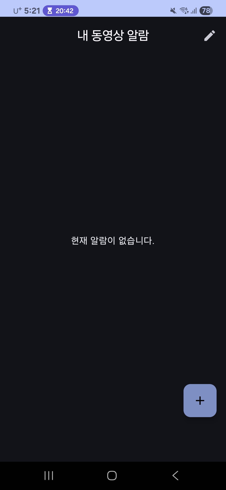
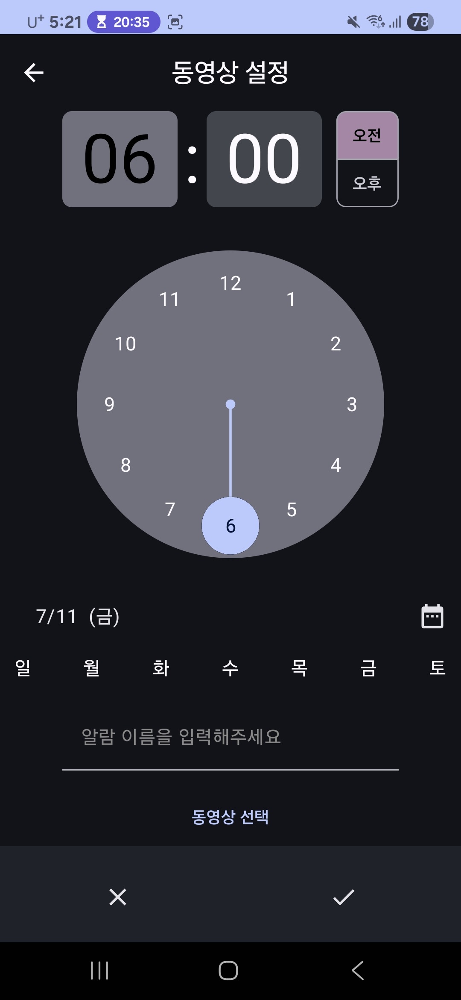
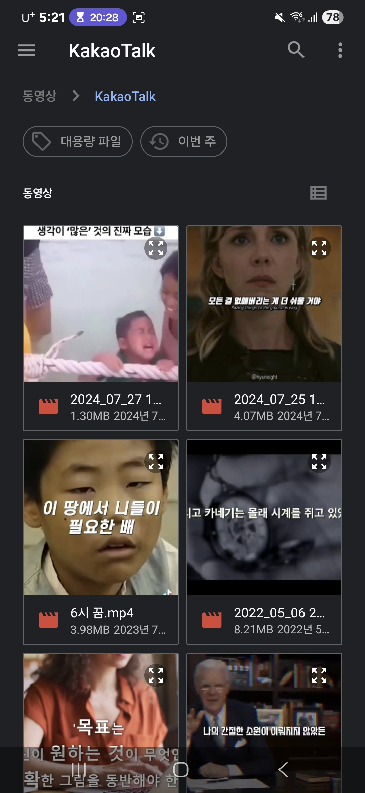
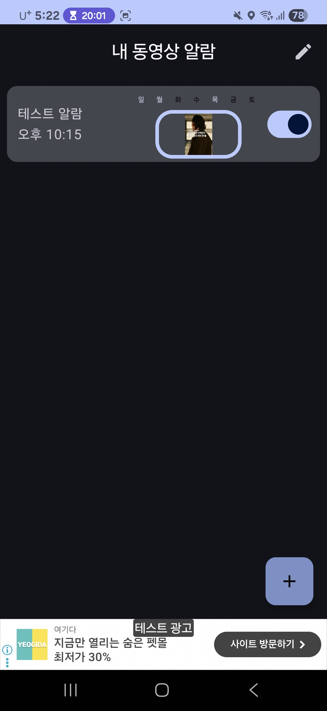

# VideoAlarm
### 동영상을 처음부터 끝까지 재생하는 알람 앱
---

## 1. 프로젝트 소개
스마트폰 기본 알람은 15 초 이하의 짧은 영상 / 단순 음원만 지원합니다. **VideoAlarm**은 '기기에 저장된' 전체 영상을 재생해 사용자에게 ‘보고 듣는’ 알람을 제공합니다.   

## 2. 주요 기능
### 1️⃣ 영상 알람 설정
- 기기 내 폴더에서 동영상 선택 → 알람에 등록  
- 알람마다 별도 요일 지정.

### 2️⃣ 전체 화면 & 잠금 화면 재생
- **잠금화면 위**에서 풀스크린 재생. 
- 가로/세로 자동 전환, 재생 위치 유지.
- 단, 휴대폰 화면이 켜져 있는 경우에는 상단 베너로 알림.

### 3️⃣ 간편 해제
- **더블 탭** 또는 **정지 버튼**으로 알람 해제.  

### 4️⃣ 정확한 알람 스케줄 (Exact Alarm)
- Android 12+ → `USE_EXACT_ALARM`, 13 / 14+ → `SCHEDULE_EXACT_ALARM` 권한 흐름을 처리하여 정시에 깨워줍니다.

### 5️⃣ 알람 관리  
- 생성/삭제/편집 시 Room DB와 동기화.

---

## 3. 기술 스택

| 역할 | 종류 |
| --- | --- |
| **Language** |  |
| **UI** |  |
| **Media** |  |
| **DI** |  |
| **DB(Local)** |  |
| **Core** |  |
| **Build** |  |
| **Version Control** |   |

---
<!--
## 4. 프로젝트 구조
app/
├─ presentation/ # Jetpack Compose UI
├─ domain/ # UseCase · Model
├─ data/
│ ├─ local/ # Room DAO · Entity · DB
│ └─ repository/
├─ di/ # Hilt Modules
└─ service/ # ForegroundService · AlarmReceiver

> **아키텍처** — MVVM + Clean Architecture 구성으로 도메인 로직과 UI를 분리해 테스트 용이성을 확보했습니다. Foreground Service에서 Media3 ExoPlayer를 실행해, 재생 중 시스템이 앱을 종료하지 않도록 보호합니다.
-->
---

### 🎥 사용 예시 (Screenshots)

| | |
|---|---|
|  |  |
|  |  |

